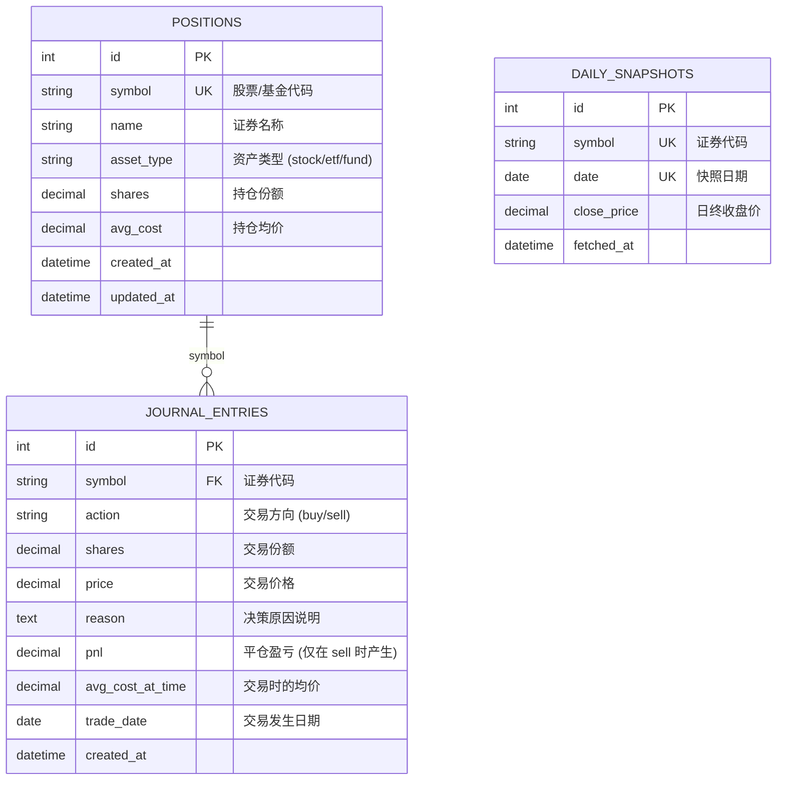

# Architecture Guide — 系统架构与设计说明

Make Money 项目采用前后端分离的本地单机架构，专注于个人投资账户的数据管理与决策动机跟踪。本文档面向开发者及系统维护者，详细剖析本项目的技术设计与架构实现。

---

## 🧭 系统拓扑结构

系统在本地运行，由前端渲染服务、后端 API 服务以及持久化数据库三层组成：

```
[用户浏览器 (React / Next.js)]
         │
         ▼ HTTP / JSON (Port 3000 -> 8000, CORS 启用)
[FastAPI 后端服务 (Uvicorn 驱动)]
         ├── [baostock_service] ────▶ [BaoStock 外部行情 API]
         └── [SQLAlchemy ORM] ──────▶ [SQLite / MySQL 数据库]
```

- **前端层 (localhost:3000)**：基于 Next.js 14 App Router 构建，提供纯响应式的仪表板界面，通过加载骨架屏遮罩（Skeleton Overlay）和兜底显示防御无行情、网络延迟等异常状态。
- **后端层 (localhost:8000)**：基于 FastAPI 框架，提供强类型数据模型和 REST API，由 Uvicorn 提供 ASGI 服务。
- **数据层 (Local sqlite / MySQL)**：基于 SQLAlchemy 驱动，在核心交易写入时采用关系型数据库事务机制保证原子性。

---

## 🗄️ 数据库 Schema 设计

数据层共包含三张核心业务表：



1. **`positions` (持仓表)**：存储当前账户中各类资产的实时存量状态，其中 `symbol` 具备唯一性约束（`UNIQUE`），保证每个资产在存量中只有一行记录。
2. **`journal_entries` (决策日记表)**：记录历史上发生的每一次买入、卖出行为及交易当时的决策原由。
3. **`daily_snapshots` (每日收盘价格表)**：缓存通过 BaoStock 拉取的历史日终价格快照，避免频繁调用外部接口，其 `(symbol, date)` 构成复合唯一索引，杜绝重复写入。

---

## ⚙️ 核心业务流与设计模式

### 1. 移动加权平均成本核算 (Weighted Average Cost)
在交易日记写入时，系统采用移动加权平均法重新折算均价：
- **买入 (Buy)**：
  $$\text{新均价} = \frac{\text{旧份额} \times \text{旧均价} + \text{买入份额} \times \text{买入价}}{\text{旧份额} + \text{买入份额}}$$
  为防止并发写入中由于份额突变导致的除零错误，后端在计算前增加了非零安全检查 (`new_shares <= 0` 时拦截抛出 422 异常)。
- **卖出 (Sell)**：
  保持均价不变，并在平仓时自动计算已实现盈亏：
  $$\text{已实现盈亏 (P\&L)} = (\text{卖出价} - \text{交易前均价}) \times \text{卖出份额}$$
- **清仓 (Clearance)**：
  为保持仪表盘简洁并防止脏数据残留，当卖出后持仓份额降为 `0` 时，系统自动在事务中执行物理删除（`db.delete(position)`），当再次买入时，重新作为新资产录入并计算均价。

### 2. 事务一致性保证 (ACID)
记录决策日记和更新持仓是一组不可分割的原子操作。在 `routers/journal.py` 中，使用 SQLAlchemy 事务保证原子提交：
```python
with db.begin():
    db.add(journal_entry)
    db.query(Position).filter_by(symbol=...).update({...})
```
若其中任一步骤发生异常，全盘回滚，保证日记流水与持仓余额绝对一致。

### 3. 快照加载 N+1 SQL 优化
前端展示持仓列表需要聚合当前持仓与最新的行情价格。为避免在循环中对每个 symbol 单独发起查询（N+1 查询问题），后端使用了 SQL 窗口函数（Window Function）进行批量连接：
```sql
SELECT symbol, close_price, date FROM (
    SELECT symbol, close_price, date, 
           ROW_NUMBER() OVER (PARTITION BY symbol ORDER BY date DESC) as rn
    FROM daily_snapshots
    WHERE symbol IN (:symbols)
) WHERE rn = 1;
```
这一设计将行情匹配数据库交互降低至 **1 次批量查询**，大幅度减少了本地磁盘 I/O 和数据库负载。

### 4. 外部行情拉取与唯一约束容错
当用户刷新行情时，`BaoStock` 会返回对应交易日的收盘价。如果在周末或非交易日重复刷新，会因主键 `(symbol, date)` 冲突引发 `IntegrityError`。
后端设计了防崩溃容错模式：优雅捕获该冲突并执行 `db.rollback()`，静默忽略重复数据并判定为“跳过成功”，确保系统的健壮性。

---

## 🧪 测试体系与质量栅栏

项目后端引入了全面的 `pytest` 自动化测试机制，位于 `backend/tests/` 目录。
- **模拟层 (Mocking)**：对外部 BaoStock 网络请求进行 Mock 隔离，确保本地测试无需联网即可秒级运行。
- **内存数据库运行**：测试套件启动时，基于 SQLite 的 `:memory:` 内存模式，在完全隔离的数据环境下运行。
- **质量标准**：核心资产计算、均价折算、超卖越权、清仓与冲突容灾代码的测试覆盖率达到 **100%**。
